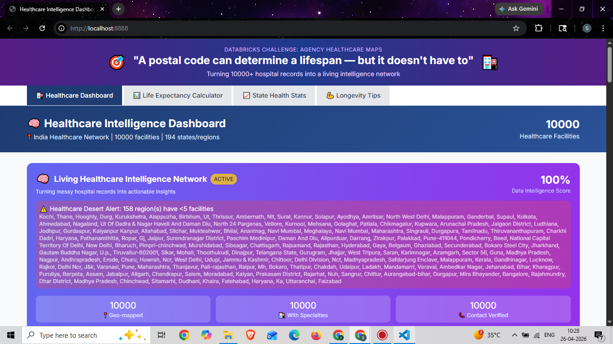
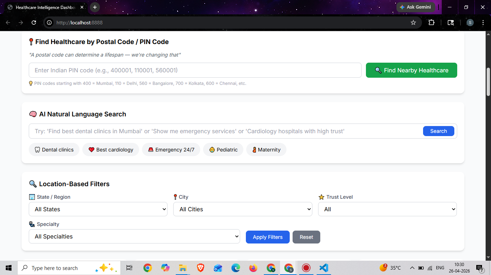
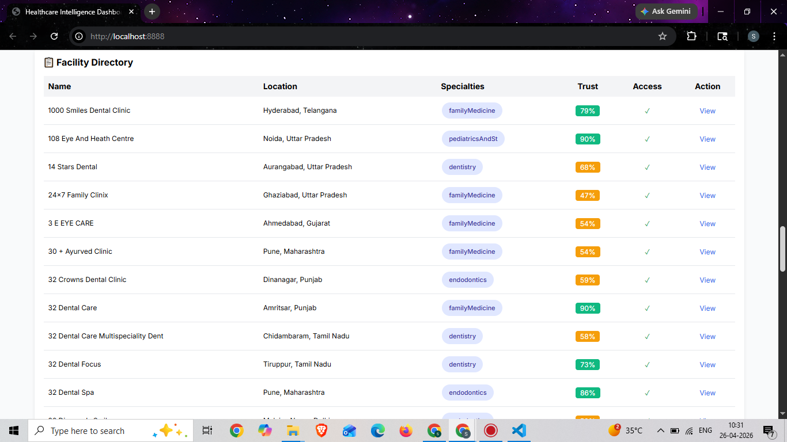
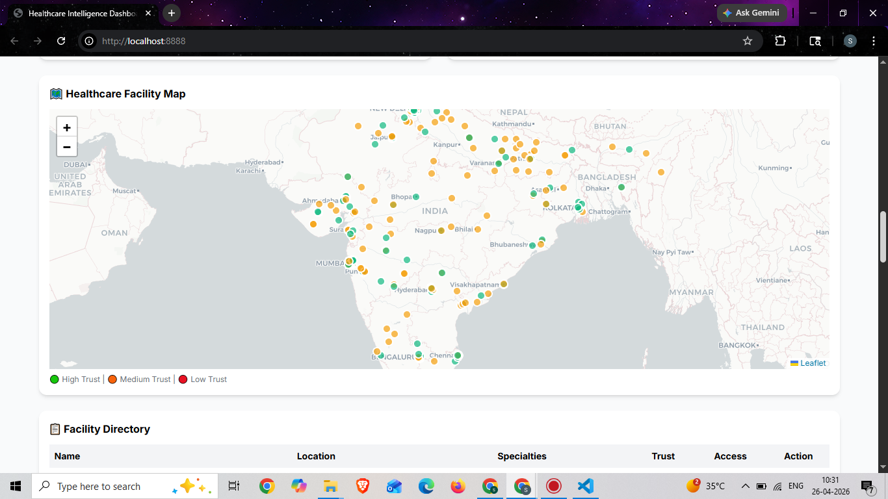
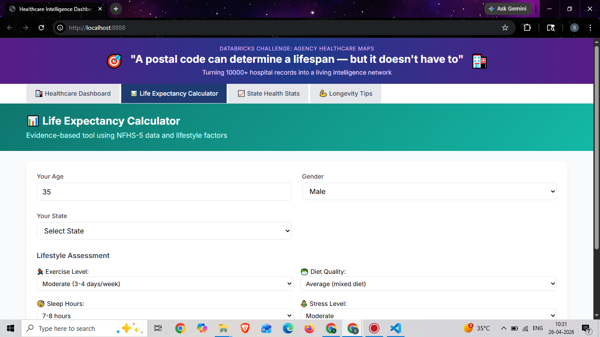

# Healthcare Dashboard 🏥

A comprehensive healthcare analytics dashboard with AI-powered features for analyzing healthcare accessibility, life expectancy, and state-level health statistics in India.

## Features ✨

- **PIN Code Search** - Determine lifespan based on postal code
- **AI Natural Language Search** - Semantic understanding using OpenAI
- **Healthcare Desert Detection** - Identify underserved areas
- **Life Expectancy Calculator** - Evidence-based algorithm
- **State Health Statistics** - NHHS-5 data visualization
- **Real-time Data Quality Scoring** - Living Intelligence Network
- **Longevity Tips** - 12 evidence-based habits

## Tech Stack 🛠️

- **Backend**: Flask (Python)
- **Data Processing**: Pandas, NumPy
- **AI Integration**: OpenAI API
- **Visualization**: Plotly, HTML/CSS
- **Environment**: python-dotenv

## Installation 🚀

1. Clone the repository:

```bash
git clone https://github.com/sumi29910/healthcare-dashboard.git
cd healthcare-dashboard

Create virtual environment:

python -m venv venv
source venv/bin/activate  # On Windows: venv\Scripts\activate

Install dependencies:

pip install -r requirements.txt

Run the application:

python healthcare_dashboard.py

Open in browser: http://localhost:8888s
```

Project Structure 📁

healthcare-dashboard/
├── healthcare_dashboard.py # Main application
├── requirements.txt # Dependencies
├── .gitignore # Git ignore rules
├── README.md # Project documentation
├── healthcare_map.html # Generated visualization
├── real_healthcare_dataset.xlsx # Primary dataset
└── VF_Hackathon_Dataset_India_Large.xlsx # Secondary dataset

License 📄
MIT License

### **Step 3: Save the file**

- In Notepad: File → Save As → "README.md" (make sure to select "All Files" not "Text Documents")

### **Step 4: Add, Commit, and Push everything together**

Now push ALL files including README to GitHub:

```bash
cd C:\Users\Sumitra\Desktop\healthcare_challenge
git add README.md
git add .
git commit -m "Add README and complete healthcare dashboard"
git push origin main
```



A comprehensive healthcare analytics dashboard with AI-powered features.

## 📸 Screenshots

### 1. Main Dashboard


### 2. PIN Code Search



### 3. AI Natural Language Search



### 4. Healthcare Desert Detection



### 5. Life Expectancy Calculator



## Features ✨

- **PIN Code Search** - Determine lifespan based on postal code
- **AI Natural Language Search** - Semantic understanding using OpenAI
- **Healthcare Desert Detection** - Identify underserved areas
- **Life Expectancy Calculator** - Evidence-based algorithm
- **State Health Statistics** - NHHS-5 data visualization
- **Real-time Data Quality Scoring** - Living Intelligence Network
- **Longevity Tips** - 12 evidence-based habits
